# Image Audit

| File | Place | Source URL | Original Size | New Size | Preview |
|------|-------|------------|---------------|----------|---------|
| day26.png | 📅 DÍA 26 París (Crucero Sena - Torre Eiffel + Perfumes + Louvre) | N/A | 6538 bytes | 600x400 | 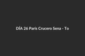 |
| cisnes.png | Isla de los Cisnes | N/A | 585213 bytes | 600x400 |  |
| libertad.png | Estatua de la Libertad (París) | N/A | 515770 bytes | 600x400 | 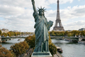 |
| torre-eiffel.png | Torre Eiffel | N/A | 472910 bytes | 600x400 | 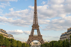 |
| champ-de-mars.png | Champ de Mars | N/A | 510585 bytes | 600x400 | 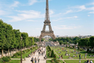 |
| fragonard-opera.png | Taller de Perfumes Fragonard (Ópera) | N/A | 617085 bytes | 600x400 | 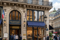 |
| cedric-grolet-opera.png | Cédric Grolet (Ópera) | N/A | 7518 bytes | 600x400 |  |
| louvre-samotracia.png | Victoria de Samotracia | N/A | 7079 bytes | 600x400 | 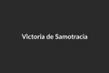 |
| louvre-monalisa.png | La Mona Lisa | N/A | 6450 bytes | 600x400 |  |
| louvre-grangal.png | Gran Galería Italiana | N/A | 6664 bytes | 600x400 |  |
| louvre-napoleon.png | La Coronación de Napoleón | N/A | 6804 bytes | 600x400 | 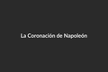 |
| louvre-libertad.png | La Libertad Guiando al Pueblo | N/A | 6367 bytes | 600x400 | 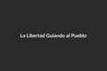 |
| louvre-espanola.png | Pintura Española | N/A | 6564 bytes | 600x400 |  |
| louvre-patizambo.png | El Patizambo | N/A | 6348 bytes | 600x400 |  |
| louvre-venus.png | Venus de Milo | N/A | 348766 bytes | 600x400 | 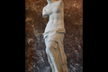 |
| louvre-egipto.png | Antigüedades Egipcias | N/A | 7534 bytes | 600x400 |  |
| louvre-hammurabi.png | Código de Hammurabi | N/A | 6724 bytes | 600x400 | 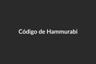 |
| louvre-marlypuget.png | Patios Marly y Puget | N/A | 6891 bytes | 600x400 |  |
| louvre-apolo.png | Galería de Apolo | N/A | 7256 bytes | 600x400 |  |
| day27.png | 📅 DÍA 27 París profundo | N/A | 6752 bytes | 600x400 | 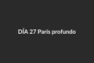 |
| arco-triunfo.png | Arco del Triunfo | N/A | 6195 bytes | 600x400 |  |
| champs-elysees.png | Champs‑Élysées | N/A | 547227 bytes | 600x400 | 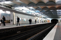 |
| ange-jacques-gabriel.png | Ange‑Jacques Gabriel | N/A | 358436 bytes | 600x400 | 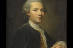 |
| plaza-concordia.png | Plaza de la Concordia | N/A | 385946 bytes | 600x400 | 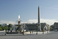 |
| fuente-rios.png | Fuente de los Ríos (Fontaine des Fleuves) | N/A | 6306 bytes | 600x400 | 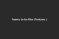 |
| obelisco-luxor.png | Obelisco de Luxor | N/A | 6798 bytes | 600x400 |  |
| jardines-tullerias.png | Jardines de las Tullerías | N/A | 6347 bytes | 600x400 | 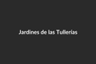 |
| julio-cesar-anibal.png | Julio César vs Aníbal Barca | N/A | 6653 bytes | 600x400 |  |
| gran-fuente-redonda.png | Gran Fuente Redonda (Grand Bassin Rond) | N/A | 6606 bytes | 600x400 |  |
| plaza-piramides.png | Plaza de las Pirámides – Estatua de Juana de Arco | N/A | 6467 bytes | 600x400 | 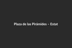 |
| arco-carrusel.png | Arco de Triunfo del Carrusel | N/A | 6314 bytes | 600x400 |  |
| beffroi-saint-germain.png | Beffroi de l'Église Saint‑Germain l'Auxerrois | N/A | 6857 bytes | 600x400 | 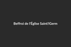 |
| jacques-de-molay.png | Jacques de Molay | N/A | 313442 bytes | 600x400 |  |
| notre-dame.png | Notre Dame | N/A | 6800 bytes | 600x400 |  |
| panteon-paris.png | Panteón de París | N/A | 6729 bytes | 600x400 | 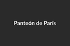 |
| jardin-luxemburgo.png | Jardín de Luxemburgo | N/A | 6416 bytes | 600x400 |  |
| le-faune-dansant.png | Le Faune Dansant | N/A | 6136 bytes | 600x400 |  |
| marchande-masques.png | La Marchande de Masques | N/A | 6728 bytes | 600x400 | 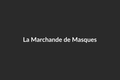 |
| santa-genoveva.png | Santa Genoveva | N/A | 7298 bytes | 600x400 |  |
| estatua-libertad-luxemburgo.png | Estatua de la Libertad | N/A | 6452 bytes | 600x400 | 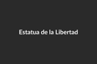 |
| acteur-grec.png | L’Acteur Grec | N/A | 6824 bytes | 600x400 |  |
| bocca-verita.png | Bocca della Verità | N/A | 7083 bytes | 600x400 |  |
| maria-medici.png | María de Médici (Reinas de la Allée des Reines) | N/A | 6738 bytes | 600x400 | 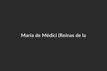 |
| ana-bretana.png | Ana de Bretaña (Reinas de la Allée des Reines) | N/A | 6874 bytes | 600x400 |  |
| luisa-saboya.png | Luisa de Saboya (Reinas de la Allée des Reines) | N/A | 6799 bytes | 600x400 | 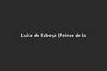 |
| margarita-navarra.png | Margarita de Navarra (Reinas de la Allée des Reines) | N/A | 6839 bytes | 600x400 | 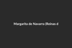 |
